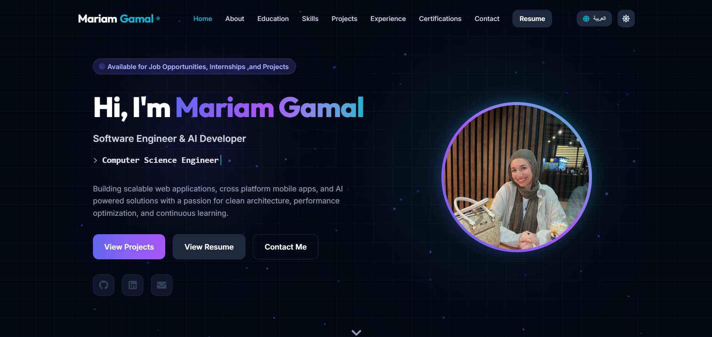

# Mariam Gamal - Personal Portfolio Website

A modern, professional, and visually striking personal portfolio website for **Mariam Gamal**, a Computer Science Engineering student, **Software Engineer & AI Developer**. Built using a sleek dark/light tech aesthetic, featuring glassmorphism layouts, full Arabic/English bilingual support (RTL/LTR), performant micro-animations, and direct live contact form integration.



---

## 🚀 Live Demo & Repository
- **Live Demo URL**: [mariam-gamal-portfolio.vercel.app](https://mariam-gamal-portfolio.vercel.app/)
- **GitHub Repository**: [github.com/mariammgamall/my-portfolio](https://github.com/mariammgamall/my-portfolio)
- **LinkedIn Profile**: [linkedin.com/in/mariam-gamal-3b2408281](https://linkedin.com/in/mariam-gamal-3b2408281)
- **Primary Contact**: [maryamgamal188@gmail.com](mailto:maryamgamal188@gmail.com)

---

## 🛠️ Tech Stack & Key Tools
- **Core Framework**: [React.js](https://react.dev/) + [TypeScript](https://www.typescriptlang.org/) (powered by [Vite](https://vite.dev/))
- **Styles**: [Tailwind CSS v4](https://tailwindcss.com/) (using native PostCSS + `@theme` CSS configuration)
- **Internationalization (i18n)**: Custom React `LanguageContext` supporting full Arabic (RTL) & English (LTR) switching with local storage persistence and Google's [Cairo](https://fonts.google.com/specimen/Cairo) font
- **Animations**: [Framer Motion](https://www.framer.com/motion/) (scroll reveals, page modals, interactive card transitions, typewriter effects)
- **Icons**: [React Icons](https://react-icons.github.io/react-icons/)
- **Live Contact Delivery**: [FormSubmit API](https://formsubmit.co/) sending live messages directly to `maryamgamal188@gmail.com`
- **Build / Packaging**: Vite Bundler (producing highly optimized client static chunks)

---

## ✨ Features & Architecture

1. **Hero / Landing**:
   - **Particle Network Background**: Renders a reactive canvas-based nodes network connecting dynamically.
   - **Typewriter Effect**: Cycles through technical roles (*Computer Science Engineer*, *Full Stack Developer*, *Mobile App Developer* / *مهندسة علوم حاسب*, *مطورة فول ستاك*, *مطورة تطبيقات موبايل*).
   - **Availability Tagline**: Prominently displays *"Available for Job Opportunities, Internships ,and Projects"* / *"متاحة لفرص العمل، التدريب، والمشاريع"*.
   - **Bio Summary**: Highlights experience in building scalable web applications, cross-platform mobile apps, and AI-powered solutions.
   - **Profile Glow Avatar**: Customized circular tech-glow crop highlighting the professional profile image.

2. **Full Arabic / English Bilingual Support (RTL/LTR)**:
   - Header button **`العربية` / `English`** toggles complete website translation instantly.
   - Automatically handles `dir="rtl"` vs `dir="ltr"`, font family overrides, and element alignment across all components.

3. **About Section**:
   - Incorporates academic & software engineering overview across 3 structured paragraphs (Software Engineering, AI/RAG, Mobile Apps, UI/UX, and Clean Architecture).
   - Features animated count-up stat counters (E-JUST study years, 12+ completed projects, 7 internships, 20+ technical skills).

4. **Education & Technical Skills**:
   - **Education**: Detailed timeline for E-JUST B.Sc. and El Zahraa American Diploma with active volunteering & events.
   - **Technical Skills**: Organizes 20+ technical skills into a balanced **6-category grid** (*Languages*, *Web & Frameworks*, *Mobile & UI/UX*, *Databases & ORMs*, *AI & Machine Learning*, *Tools & Workflow*) with explicit LTR chip badge direction rules for RTL mode.

5. **Featured Projects (Top 3 Limit + All Projects Modal)**:
   - Displays 3 featured projects on the main landing grid (Full-Stack LMS Monorepo, Aura Customer Ordering System, and AI Knowledge & Reasoning Engine).
   - **Project Details Tab/Modal**: Interactive detail modal with full-resolution screenshots, complete tech stack badges, project overview, and a **Live Demo** button.
   - **View All Projects Button**: Full-page modal overlay displaying the complete project collection.

6. **Animated Experience Timeline**:
   - Includes 7 internships & diploma entries:
     - **Information Technology Institute (ITI)** — Software Testing (Aug 2026 - Present)
     - **Route Academy- IT Training Center** — Front-End Development Diploma (June 2026 - Present)
     - **SyntecxHub Company** — UI/UX Design Internship (Jun 3 – Jul 3, 2026)
     - **Decode Labs Company** — AI Internship (Jun 1 – Jul 1, 2026)
     - **Tips Hindawi Company** — Generative AI Internship Program (Dec 2025 – Feb 2026)
     - **Saham Al Shamal Eng’g Consultants Co. (SASEC)** — Online Training IT Intern (Jul – Aug 2025)
     - **Alexandria Mineral Oils Company (AMOC)** — Industrial IT Intern (Sep 2024)

7. **Certifications**:
   - Displays top 3 certificates with **View All Certificates** modal.
   - High-resolution PNG image previews ensuring 100% native mobile rendering on Android Chrome & iOS Safari without iframe cutoffs.
   - Includes optional *"Open Original PDF"* links inside the viewer modal.

8. **Live Contact Form**:
   - Transmits visitor messages directly to `maryamgamal188@gmail.com` with real-time submission feedback and customized subtitle.

---

## 💻 Getting Started (Local Development)

Follow these instructions to run the portfolio website locally on your computer.

### Prerequisites
Make sure you have [Node.js](https://nodejs.org/) installed (version 18+ is recommended).

### 1. Clone the Repository
```bash
git clone https://github.com/mariammgamall/my-portfolio.git
cd my-portfolio
```

### 2. Install Dependencies
```bash
npm install
```

### 3. Start the Development Server
- **To run locally on your computer:**
  ```bash
  npm run dev
  ```
- **To run on both your computer and mobile phone (local network):**
  ```bash
  npm run dev -- --host
  ```
Open the local URL (`http://localhost:5173/`) in your browser.

### 4. Build for Production
To generate an optimized production bundle:
```bash
npm run build
```

### 5. Preview the Production Build
To preview the production bundle locally:
```bash
npm run preview
```

---

## 📂 Project Structure
```text
mariam-gamal-portfolio/
├── public/                     # Static Assets
│   ├── certificates/           # PNG & PDF Certification files
│   ├── images/                 
│   │   ├── profile-image/      # Profile headshot (mariam.jpeg)
│   │   ├── projects-images/    # Screenshots for LMS, COS, and Smart-RAG
│   │   └── readme-images/      # Preview hero section screenshot (portfolio-hero-section.png)
│   ├── my resume/              # Personal curriculum vitae (mariam_gamal_cv.pdf)
│   ├── favicon.svg             # Tab browser icon
│   └── icons.svg               # SVG sprite mappings
├── src/
│   ├── components/             # Portfolio UI Components
│   │   ├── Navbar.tsx          # Navigation header & language/theme controls
│   │   ├── Hero.tsx            # Particle canvas & typewriter banner
│   │   ├── About.tsx           # Bio & animated statistics counters
│   │   ├── Education.tsx       # Degree & school details
│   │   ├── Skills.tsx          # Technical expertise categories 
│   │   ├── Projects.tsx        # Top 3 grid, project detail modal & view all modal
│   │   ├── Experience.tsx      # Vertical internship timeline 
│   │   ├── Certifications.tsx  # Certificates preview modal & view all modal
│   │   ├── Contact.tsx         # Contact info & FormSubmit live email form
│   │   └── Footer.tsx          # Clean footer
│   ├── context/
│   │   └── LanguageContext.tsx # Bilingual state & RTL/LTR coordinator
│   ├── data/
│   │   └── translations.ts     # Complete English & Arabic translation dictionary
│   ├── App.tsx                 # Root layout & dark mode state
│   ├── main.tsx                # Application entrypoint
│   └── index.css               # Tailwind CSS v4 directives & theme styles
├── index.html                  # HTML template with Cairo & Inter Google Fonts
├── package.json                # Project configurations & dependencies
└── tsconfig.json               # TypeScript configuration
```
